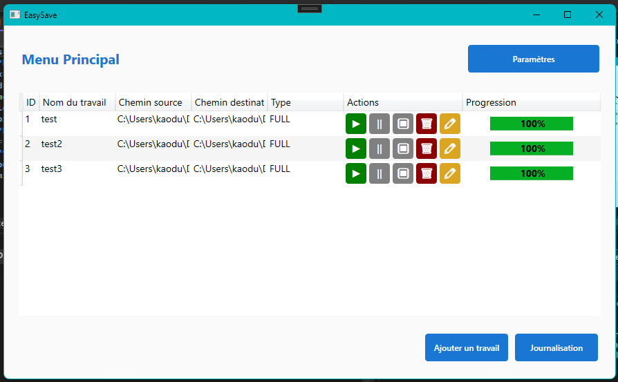

#### _Read this in English._

<kbd>[](translations/User_guide_En.md)</kbd>

# Guide d'utilisation de l'application EasySave (Console)

Ce guide vous accompagne dans l'utilisation de l'application EasySave version console, conçue pour gérer des travaux de sauvegarde complète ou différentielle.

## Avant de commencer

1. **Ouvrez le projet :**

   - Localisez et ouvrez le fichier `ConsolApp.csproj` avec Visual Studio. Ce fichier contient l’intégralité du projet.

2. **Exécutez le code :**
   - Une fois le projet ouvert, cliquez sur le bouton "Démarrer" ou appuyez sur `F5` pour lancer l’application.

---

## 1. Choix initial

Lorsque l'application démarre, vous arrivez sur le menu suivant :



```
[1] Changer la langue
[2] Lancer une sauvegarde
[3] Quitter
```

Saisissez `2` pour lancer une sauvegarde.

---

## 2. Menu des sauvegardes

Un second menu apparaît :

```
[1] Afficher les travaux
[2] Ajouter une sauvegarde
[3] Supprimer une sauvegarde
[4] Exécuter une sauvegarde
[5] Quitter
```

---

## 3. Ajouter une sauvegarde

Saisissez `2` pour ajouter une nouvelle sauvegarde. Vous devrez ensuite procéder comme suit :

1. **Saisissez un nom de sauvegarde**

   - Exemple : `Nom : > MaSauvegarde`

2. **Choisissez un type de sauvegarde**

   ```
   [1] Complète
   [2] Différentielle
   ```

   - Saisissez `1` ou `2` selon le type souhaité.

3. **Sélectionnez le lecteur source**

   - Saisissez par exemple `C` pour accéder à `C:\`.
   - Le contenu du lecteur vous sera alors affiché.
     - Naviguez dans les dossiers en saisissant leur numéro.
     - Validez avec `s`.
     - Annulez avec `q`.

4. **Sélectionnez ensuite le lecteur de destination**
   - Répétez la même procédure pour définir le dossier cible.

---

## 4. Exécuter une sauvegarde

Revenez au menu précédent et saisissez `4`. Vous devrez ensuite :

- Saisir le nom de la sauvegarde que vous avez créée (ex. : `MaSauvegarde`).
- La sauvegarde démarre automatiquement.
- Un message de confirmation ou d’erreur s’affichera en fonction du résultat.

---

## 5. Afficher ou supprimer une sauvegarde (optionnel)

- Saisissez `1` pour afficher la liste des sauvegardes enregistrées.
- Saisissez `3` pour supprimer une sauvegarde (vous devrez saisir son nom).

---

## 6. Retour ou quitter l’application

- Saisissez `q` pour revenir au menu principal.
- Dans le menu principal, saisissez `3` pour quitter l’application.
